## HOW TO NEW A SAP ODATA SERVICE

### 1. Create OData Service Application

#### 1.1. Enter [Business Application Studio] of your trial account
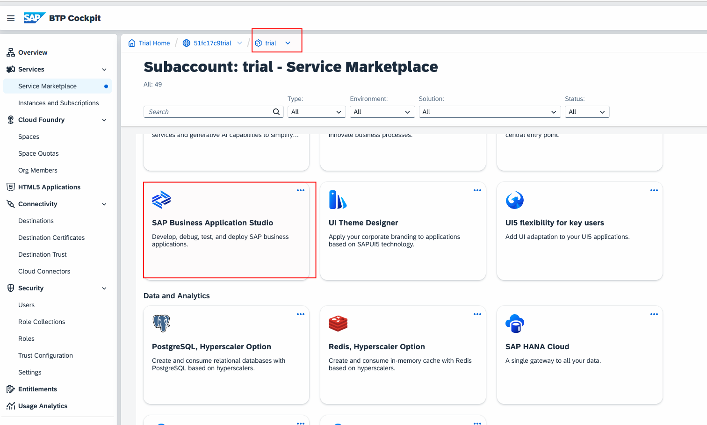
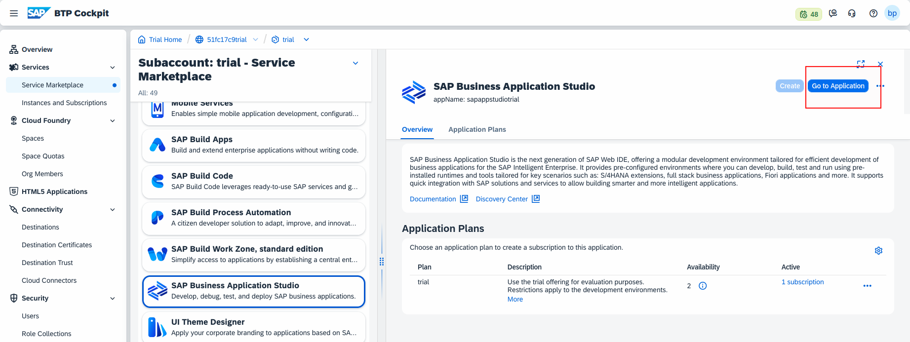
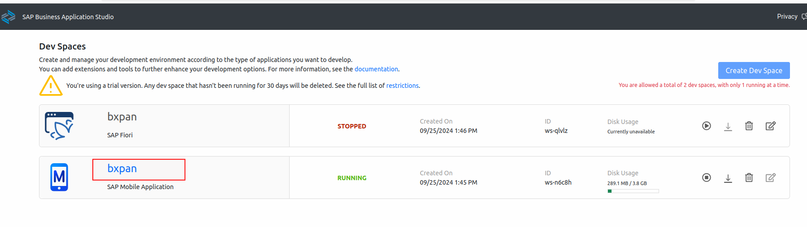

#### 1.2. Create a new project
- New path and open the project path
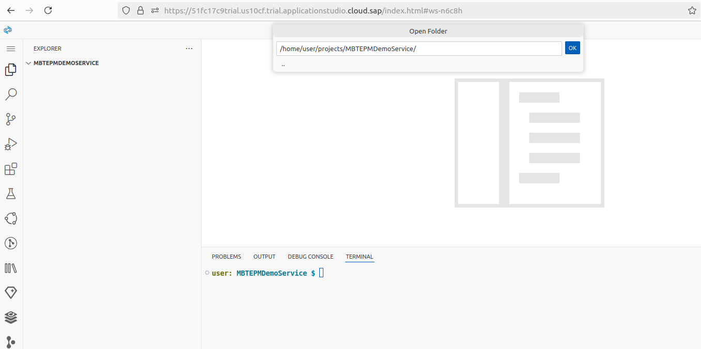
#### 1.3. Create metadata template
- At the top left of the page, View → Command Palette… Open
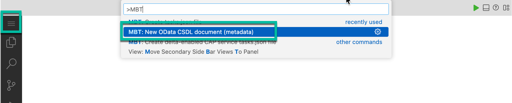

- Input the params as below
|Prompt 	|Value|
|--|--|
|Schema namespace 	|com.gs.mtb.demo|
|Namespace alias name |	Self|
|Metadata file name 	|metadata.csdl.xml|

- Find out the file `metadata.csdl.xml|` at the project's root directory
- Modify the content of `metadata.csdl.xml|`

```xml
<?xml version="1.0" encoding="utf-8"?>
<edmx:Edmx Version="4.0" xmlns:edmx="http://docs.oasis-open.org/odata/ns/edmx" xmlns:xsi="http://www.w3.org/2001/XMLSchema-instance" xsi:schemaLocation="http://docs.oasis-open.org/odata/ns/edmx http://docs.oasis-open.org/odata/odata/v4.0/os/schemas/edmx.xsd http://docs.oasis-open.org/odata/ns/edm http://docs.oasis-open.org/odata/odata/v4.0/os/schemas/edm.xsd">
    <edmx:Reference Uri="https://oasis-tcs.github.io/odata-vocabularies/vocabularies/Org.OData.Capabilities.V1.xml">
        <edmx:Include Namespace="Org.OData.Capabilities.V1" Alias="Capabilities"/>
    </edmx:Reference>
    <edmx:Reference Uri="https://oasis-tcs.github.io/odata-vocabularies/vocabularies/Org.OData.Repeatability.V1.xml">
        <edmx:Include Namespace="Org.OData.Repeatability.V1" Alias="Repeatability"/>
    </edmx:Reference>
    <edmx:Reference Uri="https://oasis-tcs.github.io/odata-vocabularies/vocabularies/Org.OData.Core.V1.xml">
        <edmx:Include Namespace="Org.OData.Core.V1" Alias="Core"/>
    </edmx:Reference>
    <edmx:Reference Uri="https://oasis-tcs.github.io/odata-vocabularies/vocabularies/Org.OData.Validation.V1.xml">
        <edmx:Include Namespace="Org.OData.Validation.V1" Alias="Validation"/>
    </edmx:Reference>
    <edmx:DataServices>
        <Schema Namespace="com.sap.mbtepmdemo" xmlns="http://docs.oasis-open.org/odata/ns/edm" Alias="Self">
            <EnumType Name="Gender" UnderlyingType="Edm.Int32">
                <Member Name="Male" Value="0"/>
                <Member Name="Female" Value="1"/>
                <Member Name="Other" Value="2"/>
                <Member Name="None" Value="3"/>
                <Member Name="Unknown" Value="4"/>
            </EnumType>
            <EntityType Name="Customer">
                <Key>
                    <PropertyRef Name="CustomerID"/>
                </Key>
                <Property Name="City" Type="Edm.String" Nullable="true" MaxLength="40"/>
                <Property Name="Country" Type="Edm.String" Nullable="true" MaxLength="3"/>
                <Property Name="CustomerID" Type="Edm.Int64" Nullable="false" MaxLength="10">
                    <Annotation Term="Org.OData.Core.V1.Computed"/>
                </Property>
                <Property Name="DateOfBirth" Type="Edm.Date" Nullable="false"/>
                <Property Name="EmailAddress" Type="Edm.String" Nullable="true" MaxLength="255"/>
                <Property Name="Gender" Type="com.sap.mbtepmdemo.Gender" Nullable="true"/>
                <Property Name="FirstName" Type="Edm.String" Nullable="true" MaxLength="40"/>
                <Property Name="HouseNumber" Type="Edm.String" Nullable="true" MaxLength="10"/>
                <Property Name="LastName" Type="Edm.String" Nullable="true" MaxLength="40"/>
                <Property Name="PhoneNumber" Type="Edm.String" Nullable="true" MaxLength="30"/>
                <Property Name="PostalCode" Type="Edm.String" Nullable="true" MaxLength="10"/>
                <Property Name="Street" Type="Edm.String" Nullable="true" MaxLength="60"/>
                <Property Name="Address" Type="com.sap.mbtepmdemo.Address" Nullable="true"/>
                <NavigationProperty Name="SalesOrders" Type="Collection(com.sap.mbtepmdemo.SalesOrderHeader)" Partner="Customer">
                    <OnDelete Action="None"/>
                </NavigationProperty>
            </EntityType>
            <ComplexType Name="Address">
                <Property Name="HouseNumber" Type="Edm.String" Nullable="true"/>
                <Property Name="Street" Type="Edm.String" Nullable="true"/>
                <Property Name="City" Type="Edm.String" Nullable="true"/>
                <Property Name="Country" Type="Edm.String" Nullable="true"/>
                <Property Name="PostalCode" Type="Edm.String" Nullable="true"/>
            </ComplexType>
            <EntityType Name="Supplier">
                <Key>
                    <PropertyRef Name="SupplierID"/>
                </Key>
                <Property Name="City" Type="Edm.String" Nullable="true" MaxLength="40"/>
                <Property Name="Country" Type="Edm.String" Nullable="true" MaxLength="3"/>
                <Property Name="EmailAddress" Type="Edm.String" Nullable="true" MaxLength="255"/>
                <Property Name="HouseNumber" Type="Edm.String" Nullable="true" MaxLength="10"/>
                <Property Name="PhoneNumber" Type="Edm.String" Nullable="true" MaxLength="30"/>
                <Property Name="PostalCode" Type="Edm.String" Nullable="true" MaxLength="10"/>
                <Property Name="Street" Type="Edm.String" Nullable="true" MaxLength="60"/>
                <Property Name="SupplierID" Type="Edm.Int64" Nullable="false" MaxLength="10">
                    <Annotation Term="Org.OData.Core.V1.Computed"/>
                </Property>
                <Property Name="SupplierName" Type="Edm.String" Nullable="true" MaxLength="80"/>
                <Property Name="Address" Type="com.sap.mbtepmdemo.Address" Nullable="true"/>
                <NavigationProperty Name="Products" Type="Collection(com.sap.mbtepmdemo.Product)" Partner="Supplier">
                    <OnDelete Action="None"/>
                </NavigationProperty>
                <NavigationProperty Name="PurchaseOrders" Type="Collection(com.sap.mbtepmdemo.PurchaseOrderHeader)" Partner="Supplier">
                    <OnDelete Action="None"/>
                </NavigationProperty>
            </EntityType>
            <EntityType Name="Product">
                <Key>
                    <PropertyRef Name="ProductID"/>
                </Key>
                <Property Name="Category" Type="Edm.String" Nullable="true" MaxLength="40"/>
                <Property Name="CategoryName" Type="Edm.String" Nullable="true" MaxLength="40"/>
                <Property Name="CurrencyCode" Type="Edm.String" Nullable="true" MaxLength="5"/>
                <Property Name="DimensionDepth" Type="Edm.Decimal" Nullable="true" Precision="13" Scale="4"/>
                <Property Name="DimensionHeight" Type="Edm.Decimal" Nullable="true" Precision="13" Scale="4"/>
                <Property Name="DimensionUnit" Type="Edm.String" Nullable="true" MaxLength="3"/>
                <Property Name="DimensionWidth" Type="Edm.Decimal" Nullable="true" Precision="13" Scale="4"/>
                <Property Name="LongDescription" Type="Edm.String" Nullable="true" MaxLength="255"/>
                <Property Name="Name" Type="Edm.String" Nullable="false" MaxLength="80"/>
                <Property Name="PictureUrl" Type="Edm.String" Nullable="true" MaxLength="255"/>
                <Property Name="Price" Type="Edm.Decimal" Nullable="true" Precision="23" Scale="3"/>
                <Property Name="ProductID" Type="Edm.Int64" Nullable="false" MaxLength="10">
                    <Annotation Term="Org.OData.Core.V1.Computed"/>
                </Property>
                <Property Name="QuantityUnit" Type="Edm.String" Nullable="true" MaxLength="3"/>
                <Property Name="ShortDescription" Type="Edm.String" Nullable="true" MaxLength="255"/>
                <Property Name="SupplierID" Type="Edm.Int64" Nullable="false" MaxLength="10"/>
                <Property Name="Weight" Type="Edm.Decimal" Nullable="true" Precision="13" Scale="3"/>
                <Property Name="WeightUnit" Type="Edm.String" Nullable="true" MaxLength="3"/>
                <Property Name="Picture" Type="Edm.Stream" Nullable="true"/>
                <NavigationProperty Name="Supplier" Type="com.sap.mbtepmdemo.Supplier" Nullable="false" Partner="Products">
                    <ReferentialConstraint Property="SupplierID" ReferencedProperty="SupplierID"/>
                </NavigationProperty>
                <NavigationProperty Name="Stock" Type="com.sap.mbtepmdemo.Stock" Nullable="true" Partner="Product">
                    <OnDelete Action="Cascade"/>
                </NavigationProperty>
                <NavigationProperty Name="PurchaseOrderItems" Type="Collection(com.sap.mbtepmdemo.PurchaseOrderItem)" Partner="Product">
</NavigationProperty>
                <NavigationProperty Name="SalesOrderItems" Type="Collection(com.sap.mbtepmdemo.SalesOrderItem)" Partner="Product">
</NavigationProperty>
            </EntityType>
            <EntityType Name="ProductCategory">
                <!-- TODO: reconsider key, navigation properties?-->
                <Key>
                    <PropertyRef Name="Category"/>
                </Key>
                <Property Name="Category" Type="Edm.String" Nullable="false" MaxLength="40"/>
                <Property Name="CategoryName" Type="Edm.String" Nullable="true" MaxLength="40"/>
                <Property Name="MainCategory" Type="Edm.String" Nullable="true" MaxLength="40"/>
                <Property Name="MainCategoryName" Type="Edm.String" Nullable="true" MaxLength="40"/>
                <Property Name="NumberOfProducts" Type="Edm.Int64" Nullable="true"/>
            </EntityType>
            <EntityType Name="ProductText">
                <!-- TODO: reconsider key, navigation properties?-->
                <Key>
                    <PropertyRef Name="ID"/>
                </Key>
                <Property Name="ID" Type="Edm.Int64" Nullable="false">
                    <Annotation Term="Org.OData.Core.V1.Computed"/>
                </Property>
                <Property Name="Language" Type="Edm.String" Nullable="true" MaxLength="2"/>
                <Property Name="LongDescription" Type="Edm.String" Nullable="true" MaxLength="255"/>
                <Property Name="Name" Type="Edm.String"/>
                <Property Name="ProductID" Type="Edm.Int64" Nullable="true" MaxLength="10"/>
                <Property Name="ShortDescription" Type="Edm.String" Nullable="true" MaxLength="255"/>
            </EntityType>
            <EntityType Name="PurchaseOrderHeader">
                <Key>
                    <PropertyRef Name="PurchaseOrderID"/>
                </Key>
                <Property Name="CurrencyCode" Type="Edm.String" Nullable="true" MaxLength="5"/>
                <Property Name="GrossAmount" Type="Edm.Decimal" Nullable="true" Precision="15" Scale="3"/>
                <Property Name="NetAmount" Type="Edm.Decimal" Nullable="true" Precision="15" Scale="3"/>
                <Property Name="PurchaseOrderID" Type="Edm.Int64" Nullable="false" MaxLength="10">
                    <Annotation Term="Org.OData.Core.V1.Computed"/>
                </Property>
                <Property Name="SupplierID" Type="Edm.Int64" Nullable="false" MaxLength="10"/>
                <Property Name="TaxAmount" Type="Edm.Decimal" Nullable="true" Precision="15" Scale="3"/>
                <NavigationProperty Name="Supplier" Type="com.sap.mbtepmdemo.Supplier" Nullable="false" Partner="PurchaseOrders">
                    <ReferentialConstraint Property="SupplierID" ReferencedProperty="SupplierID"/>
                </NavigationProperty>
                <NavigationProperty Name="Items" Type="Collection(com.sap.mbtepmdemo.PurchaseOrderItem)" Partner="Header">
                    <OnDelete Action="Cascade"/>
                </NavigationProperty>
            </EntityType>
            <EntityType Name="PurchaseOrderItem">
                <Key>
                    <PropertyRef Name="ItemNumber"/>
                    <PropertyRef Name="PurchaseOrderID"/>
                </Key>
                <Property Name="CurrencyCode" Type="Edm.String" Nullable="true" MaxLength="5"/>
                <Property Name="GrossAmount" Type="Edm.Decimal" Nullable="true" Precision="15" Scale="3"/>
                <Property Name="ItemNumber" Type="Edm.Int32" Nullable="false"/>
                <Property Name="NetAmount" Type="Edm.Decimal" Nullable="true" Precision="15" Scale="3"/>
                <Property Name="ProductID" Type="Edm.Int64" Nullable="false" MaxLength="10"/>
                <Property Name="PurchaseOrderID" Type="Edm.Int64" Nullable="false" MaxLength="10"/>
                <Property Name="Quantity" Type="Edm.Int32" Nullable="false" Precision="13" Scale="3"/>
                <Property Name="QuantityUnit" Type="Edm.String" Nullable="true" MaxLength="3"/>
                <Property Name="TaxAmount" Type="Edm.Decimal" Nullable="true" Precision="15" Scale="3"/>
                <NavigationProperty Name="Product" Type="com.sap.mbtepmdemo.Product" Nullable="false">
                    <ReferentialConstraint Property="ProductID" ReferencedProperty="ProductID"/>
                </NavigationProperty>
                <NavigationProperty Name="Header" Type="com.sap.mbtepmdemo.PurchaseOrderHeader" Nullable="false">
                    <ReferentialConstraint Property="PurchaseOrderID" ReferencedProperty="PurchaseOrderID"/>
                </NavigationProperty>
            </EntityType>
            <EntityType Name="SalesOrderHeader">
                <Key>
                    <PropertyRef Name="SalesOrderID"/>
                </Key>
                <Property Name="CreatedAt" Type="Edm.DateTimeOffset" Nullable="true"/>
                <Property Name="CurrencyCode" Type="Edm.String" Nullable="true" MaxLength="5"/>
                <Property Name="CustomerID" Type="Edm.Int64" Nullable="true" MaxLength="10"/>
                <Property Name="GrossAmount" Type="Edm.Decimal" Nullable="true" Precision="15" Scale="3"/>
                <Property Name="LifeCycleStatus" Type="Edm.String" Nullable="false" MaxLength="1"/>
                <Property Name="LifeCycleStatusName" Type="Edm.String" Nullable="false" MaxLength="255"/>
                <Property Name="NetAmount" Type="Edm.Decimal" Nullable="true" Precision="15" Scale="3"/>
                <Property Name="SalesOrderID" Type="Edm.Int64" Nullable="false" MaxLength="10">
                    <Annotation Term="Org.OData.Core.V1.Computed"/>
                </Property>
                <Property Name="TaxAmount" Type="Edm.Decimal" Nullable="true" Precision="15" Scale="3"/>
                <NavigationProperty Name="Customer" Type="com.sap.mbtepmdemo.Customer" Nullable="false" Partner="SalesOrders">
                    <ReferentialConstraint Property="CustomerID" ReferencedProperty="CustomerID"/>
                </NavigationProperty>
                <NavigationProperty Name="Items" Type="Collection(com.sap.mbtepmdemo.SalesOrderItem)" Partner="Header">
                    <OnDelete Action="Cascade"/>
                </NavigationProperty>
            </EntityType>
            <EntityType Name="SalesOrderItem">
                <Key>
                    <PropertyRef Name="ItemNumber"/>
                    <PropertyRef Name="SalesOrderID"/>
                </Key>
                <Property Name="MAC" Type="Edm.String" Nullable="true" MaxLength="48"/>
                <Property Name="CTN" Type="Edm.String" Nullable="true" MaxLength="48"/>
                <Property Name="CurrencyCode" Type="Edm.String" Nullable="true" MaxLength="5"/>
                <Property Name="DeliveryDate" Type="Edm.Date" Nullable="true"/>
                <Property Name="GrossAmount" Type="Edm.Decimal" Nullable="true" Precision="15" Scale="3"/>
                <Property Name="ItemNumber" Type="Edm.Int32" Nullable="false"/>
                <Property Name="NetAmount" Type="Edm.Decimal" Nullable="true" Precision="15" Scale="3"/>
                <Property Name="ProductID" Type="Edm.Int64" Nullable="false" MaxLength="10"/>
                <Property Name="Quantity" Type="Edm.Int32" Nullable="false" Precision="13" Scale="3"/>
                <Property Name="QuantityUnit" Type="Edm.String" Nullable="true" MaxLength="3"/>
                <Property Name="SalesOrderID" Type="Edm.Int64" Nullable="false" MaxLength="10"/>
                <Property Name="TaxAmount" Type="Edm.Decimal" Nullable="true" Precision="15" Scale="3"/>
                <NavigationProperty Name="Product" Type="com.sap.mbtepmdemo.Product" Nullable="false">
                    <ReferentialConstraint Property="ProductID" ReferencedProperty="ProductID"/>
                </NavigationProperty>
                <NavigationProperty Name="Header" Type="com.sap.mbtepmdemo.SalesOrderHeader" Nullable="false">
                    <ReferentialConstraint Property="SalesOrderID" ReferencedProperty="SalesOrderID"/>
                </NavigationProperty>
            </EntityType>
            <EntityType Name="Stock">
                <Key>
                    <PropertyRef Name="ProductID"/>
                </Key>
                <Property Name="LotSize" Type="Edm.Int32" Nullable="true" Precision="13" Scale="3"/>
                <Property Name="MinStock" Type="Edm.Int32" Nullable="true" Precision="13" Scale="3"/>
                <Property Name="ProductID" Type="Edm.Int64" Nullable="false" MaxLength="255"/>
                <Property Name="Quantity" Type="Edm.Int32" Nullable="true" Precision="13" Scale="3"/>
                <Property Name="QuantityLessMin" Type="Edm.Boolean" Nullable="false"/>
                <NavigationProperty Name="Product" Type="com.sap.mbtepmdemo.Product" Nullable="false">
                    <ReferentialConstraint Property="ProductID" ReferencedProperty="ProductID"/>
                </NavigationProperty>
            </EntityType>
            <Action Name="GenerateSamplePurchaseOrders">
                <ReturnType Type="Edm.Boolean" Nullable="false"/>
            </Action>
            <Action Name="GenerateSampleSalesOrders">
                <ReturnType Type="Edm.Boolean" Nullable="false"/>
            </Action>
            <Action Name="ResetSampleData">
                <ReturnType Type="Edm.Boolean" Nullable="false"/>
            </Action>
            <Action Name="UpdateSalesOrderStatus">
                <ReturnType Type="Edm.Boolean" Nullable="false"/>
                <Parameter Name="id" Type="Edm.Int64" Nullable="false"/>
                <Parameter Name="newStatus" Type="Edm.String" Nullable="false"/>
            </Action>
            <EntityContainer Name="Com_sap_mbtepmdemoService">
                <Annotation Term="Repeatability.Supported"/>
                <Annotation Term="Repeatability.DeleteWithClientIDSupported"/>
                <Annotation Term="Repeatability.DeleteWithRequestIDSupported"/>
                <Annotation Term="Capabilities.AcceptableEncodings">
                    <Collection>
                        <String>gzip</String>
                    </Collection>
                </Annotation>
                <Annotation Term="Capabilities.BatchSupported"/>
                <Annotation Term="Capabilities.SkipSupported"/>
                <Annotation Term="Capabilities.TopSupported"/>
                <EntitySet Name="Customers" EntityType="com.sap.mbtepmdemo.Customer">
                    <NavigationPropertyBinding Path="SalesOrders" Target="SalesOrderHeaders"/>
                </EntitySet>
                <EntitySet Name="Suppliers" EntityType="com.sap.mbtepmdemo.Supplier">
                    <NavigationPropertyBinding Path="Products" Target="Products"/>
                    <NavigationPropertyBinding Path="PurchaseOrders" Target="PurchaseOrderHeaders"/>
                </EntitySet>
                <EntitySet Name="Products" EntityType="com.sap.mbtepmdemo.Product">
                    <NavigationPropertyBinding Path="Supplier" Target="Suppliers"/>
                    <NavigationPropertyBinding Path="Stock" Target="Stock"/>
                    <NavigationPropertyBinding Path="PurchaseOrderItems" Target="PurchaseOrderItems"/>
                    <NavigationPropertyBinding Path="SalesOrderItems" Target="SalesOrderItems"/>
                </EntitySet>
                <EntitySet Name="ProductCategories" EntityType="com.sap.mbtepmdemo.ProductCategory"> </EntitySet>
                <EntitySet Name="ProductTexts" EntityType="com.sap.mbtepmdemo.ProductText"> </EntitySet>
                <EntitySet Name="PurchaseOrderHeaders" EntityType="com.sap.mbtepmdemo.PurchaseOrderHeader">
                    <NavigationPropertyBinding Path="Items" Target="PurchaseOrderItems"/>
                    <NavigationPropertyBinding Path="Supplier" Target="Suppliers"/>
                </EntitySet>
                <EntitySet Name="PurchaseOrderItems" EntityType="com.sap.mbtepmdemo.PurchaseOrderItem">
                    <NavigationPropertyBinding Path="Header" Target="PurchaseOrderHeaders"/>
                    <NavigationPropertyBinding Path="Product" Target="Products"/>
                </EntitySet>
                <EntitySet Name="SalesOrderHeaders" EntityType="com.sap.mbtepmdemo.SalesOrderHeader">
                    <NavigationPropertyBinding Path="Items" Target="SalesOrderItems"/>
                    <NavigationPropertyBinding Path="Customer" Target="Customers"/>
                </EntitySet>
                <EntitySet Name="SalesOrderItems" EntityType="com.sap.mbtepmdemo.SalesOrderItem">
                    <NavigationPropertyBinding Path="Header" Target="SalesOrderHeaders"/>
                    <NavigationPropertyBinding Path="Product" Target="Products"/>
                </EntitySet>
                <EntitySet Name="Stock" EntityType="com.sap.mbtepmdemo.Stock">
                    <NavigationPropertyBinding Path="Product" Target="Products"/>
                </EntitySet>
                <ActionImport Name="GenerateSamplePurchaseOrders" Action="com.sap.mbtepmdemo.GenerateSamplePurchaseOrders"/>
                <ActionImport Name="GenerateSampleSalesOrders" Action="com.sap.mbtepmdemo.GenerateSampleSalesOrders"/>
                <ActionImport Name="ResetSampleData" Action="com.sap.mbtepmdemo.ResetSampleData"/>
                <ActionImport Name="UpdateSalesOrderStatus" Action="com.sap.mbtepmdemo.UpdateSalesOrderStatus"/>
            </EntityContainer>
        </Schema>
    </edmx:DataServices>
</edmx:Edmx>
```
#### 1.4. Config connection to login Cloud Foundry
- At the top left, View → Command Palette…, Input `cf login`

- Config according to the prompt, and the result should be like:
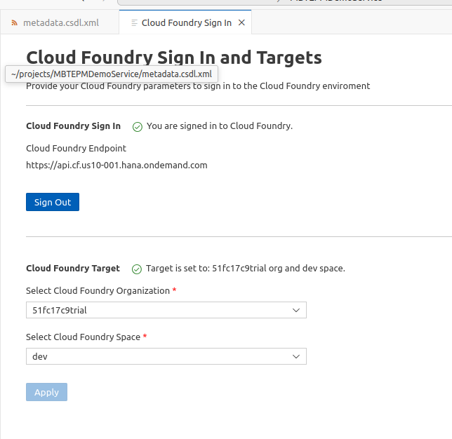

#### 1.5. Generate the Mobile Backend Server Source
- At the top left, View → Command Palette…， Input `MTB:Create Mobile Backend Server Project`
- Config ad below:
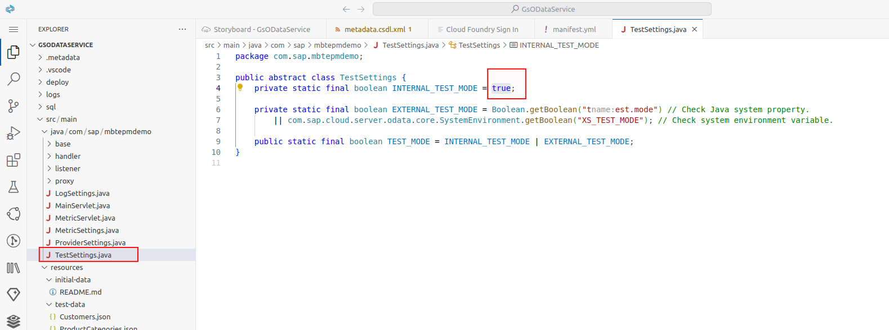
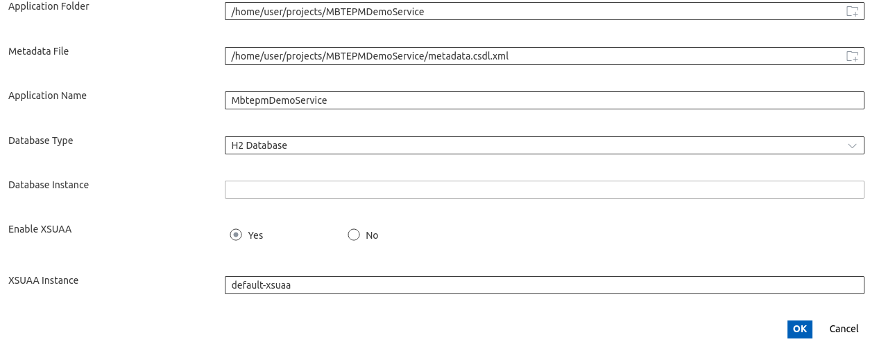

#### 1.6. Config the Route of OData Service
- Modify the `manifest.yml` as below:
	- add `random-route: true`
	- change the mem/disk to 1GB since the limitation for trial
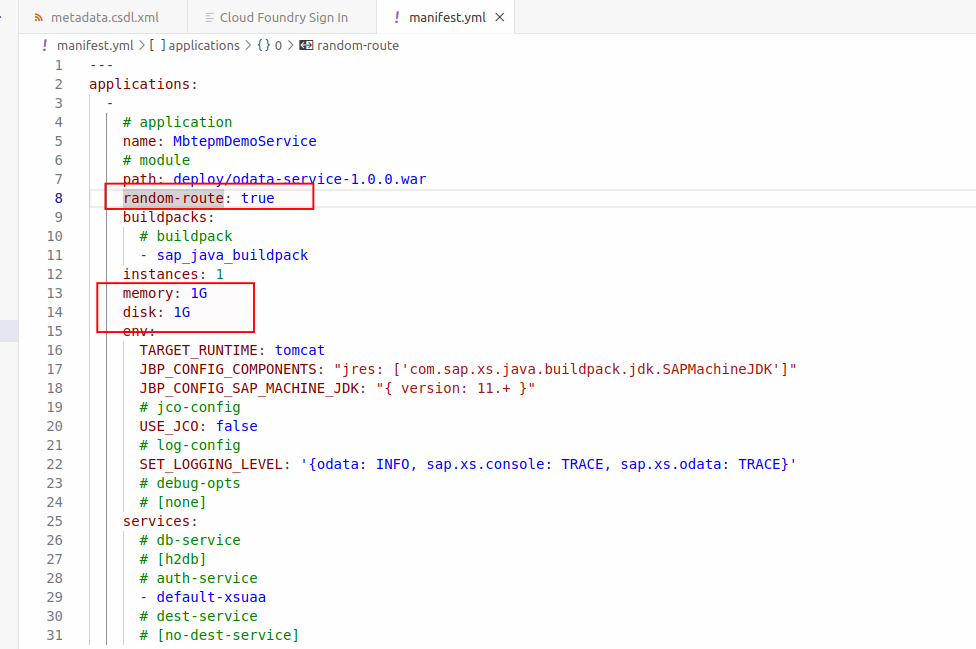

### 2. Deploy the service
- Click Runtask
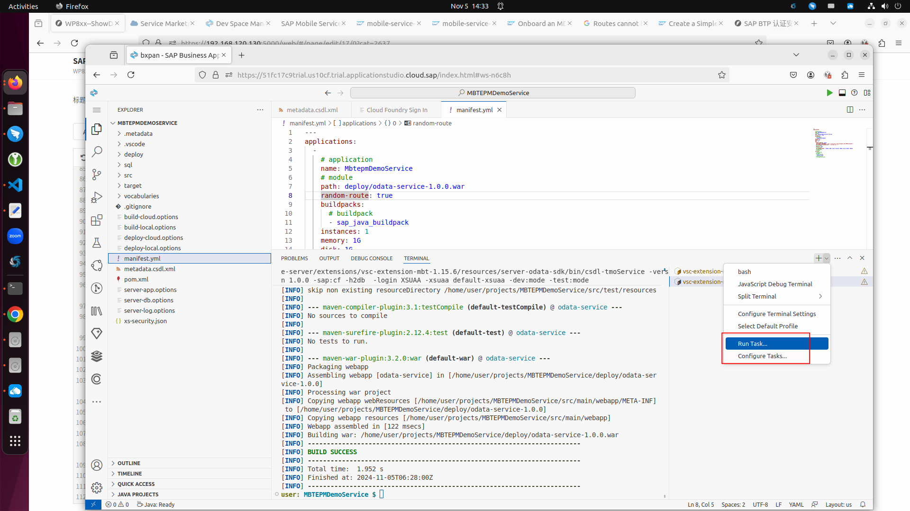
- choose deploy-mobile-server
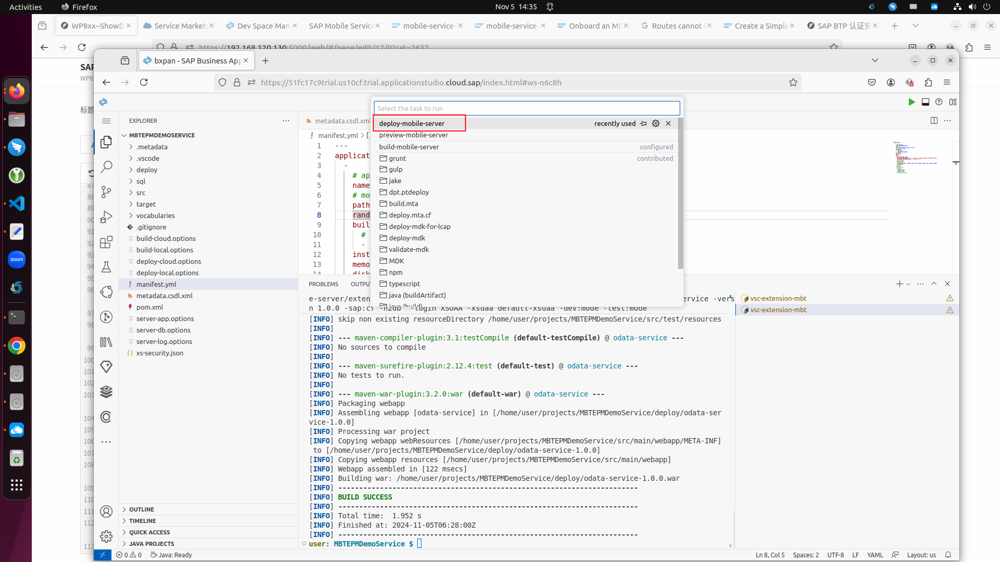
- you can get the url if deploy succeed, this url will be used when we trying to bind this OData with MDK App instance
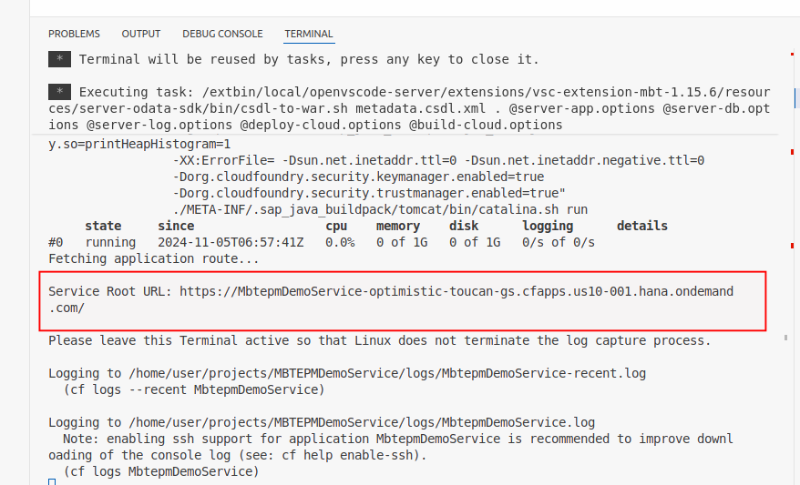


### 3. Check OData Service Status
- You can check the status of your new OData service from Trial Home as below
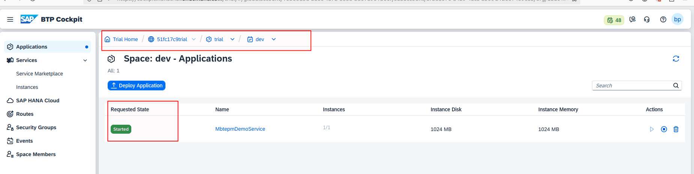

### 4. Bind with MDK App Instance
- At the MDK app details screen, Choose `Mobile Connectivity` and click "+" to new destination
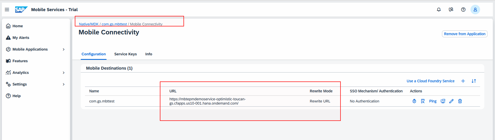
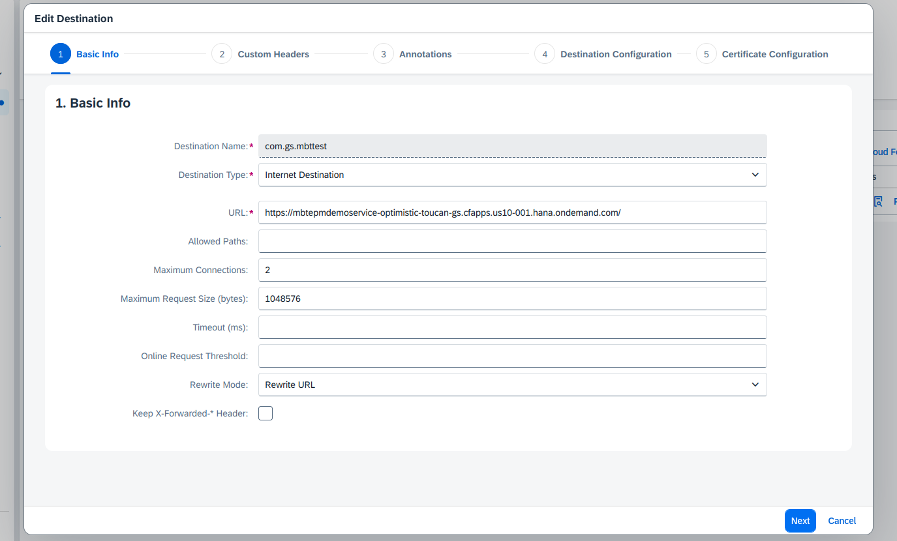
